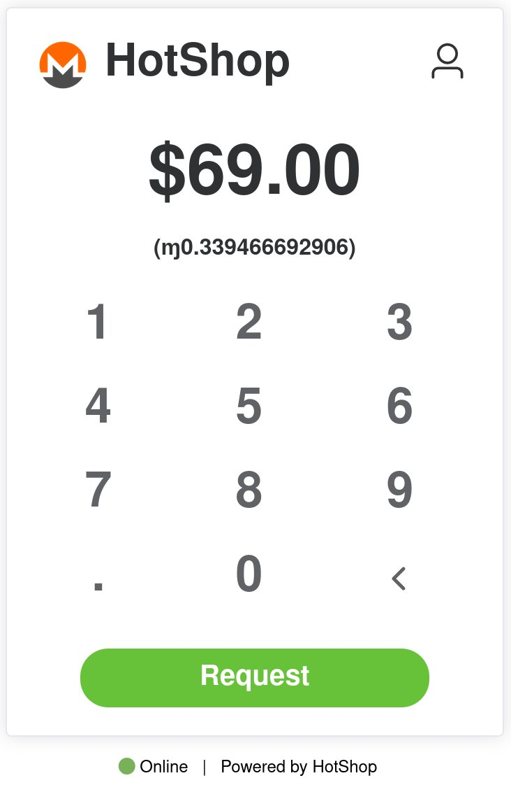

# HotShop

- [HotShop](#hotshop)
  - [Welcome](#welcome)
  - [Quickstart](#quickstart)
  - [Why do I need this? Why can't I just use a mobile wallet to accept payment?](#why-do-i-need-this-why-cant-i-just-use-a-mobile-wallet-to-accept-payment)
  - [How does this work?](#how-does-this-work)
  - [How do I use it?](#how-do-i-use-it)
  - [Self-Hosting?](#self-hosting)
  - [What does HotShop NOT do?](#what-does-hotshop-not-do)
  - [Potential Future Features/Exploration](#potential-future-featuresexploration)
  - [Donate](#donate)
  - [Special Thanks](#special-thanks)

## Welcome

Welcome to the HotShop- An ephemeral, browser-based Monero point of sale. Accept and Validate Monero payments using a bookmarkable, sharable web URL without having to download any apps or browser extensions, without losing your privacy and without putting your private keys in danger.

_Warning_
**Currently in Alpha state- please use at your own risk. Additionally, HotShop will NOT recognize funds received from the SAME wallet (sending to yourself doesn't work!). Until I feel the software is stable, I will absolutely be making occasional breaking changes. This may or may not disrupt your saved shop URL and it may disrupt your payments.  The goal is building a solid PoS experience.  If you run into issues, please let me know/write issue tickets.  I will make a normal release when there is app stability (likely in the next month or two) and remove this warning**

HotShop is a simple to use Point of Sale webapp with a simple aesthetic and UI similar to CashApp, Kasisto (RIP) or POS.cash that can be accessed from just about any web browser (on mobile or desktop) with a slight amount of user customization (company name/image, etc). It even works on Tor and works with web-compatible Monero nodes (I think).

<center> 
<figure>

<figcaption>The HotShop</figcaption>
</figure>
</center>

## Quickstart

1. Navigate to the [public HotShop website](https://hotshop.onrender.com/)
2. Add your Primary Key and Secret View Key in the Settings section (Click the person icon in the top right corner)
3. Update
4. Save the custom shop link at the top of the profile page (Bookmark it, save in a notepad etc)
5. Done! Go Collect payments!

## Why do I need this? Why can't I just use a mobile wallet to accept payment?

- The physical Point of Sale situation is very lacking in Monero - No existing wallets have good Point of Sale tech or UI.
- Your wife is at a garage sale and needs to accept and validate payments for you - just send her your custom HotShop link and she can begin collecting Moneroj FOR YOU. You could share your HotShop link to all of the servers at your restaurant as well.
- Most Point of Sale solutions require you to self-host something like BTCPayServer on a server you need to maintain.
- Perhaps you're in a situation where you can't have a wallet app on your phone/desktop but want to easily receive and VALIDATE a payment
- Perhaps you're in a situation where you want to be able to accept payments, but are worried about someone stealing your device or - spend key wallet
- An ephemeral point of sale that sort of lives on a QR code or bookmark in your phone sounds really cool
- Maybe your mobile wallet is 1000000 blocks behind and want to IMMEDIATELY accept and verify a payment - HotShop loads quite quickly and requires no sync time.
- Don't you want to make 100% sure your buddy at the bar actually sent those funds? It's better than a static payment address.

## How does this work?

HotShop is a dumb static site made of html, css, javascript and webassembly files that can be hosted on nearly any (free) static hosting provider (Github Pages, Netlify, etc); there are no servers involved outside of a public Monero node that provides your HotShop with latest blockchain data and the static site host.

You don't need to host your own HotShop, either. The site itself is dumb and anyone can use the same HotShop site, but once downloaded to your browser, it applies your custom information via Hash Fragments- the secret sauce- and makes it your own custom experience.

Rough Idea of what happens when you use HotShop:

1. Your browser hits the HotShop website and downloads the static content (HTML, CSS, etc) and sends NOTHING to the website host outside of typical browser request information (browser info, ip address, etc- this is typical) - however, your public key, view key and any custom settings of your HotShop do not get sent as part of ANY outgoing http reqeusts- they remain in your browser.
2. Your browser renders the HotShop site for you locally, and then applies your custom settings, which are saved as Hash Fragments in the big scary looking UR.
3. Using your custom settings, your browser creates a full Monero view wallet IN THE BROWSER (Thanks to @Woodser and the Monero-Javascript WASM wallet), using your Primary and View key that you've specified. These keys allow HotShop to generate fresh and unique payment addresses's as well as allow it to listen for and validate payments that happen at these generated addresses.
4. Your browser then makes a direct connection to whatever Web-Compatible Monero node you've specified as the provider of the blockchain data for your HotShop. HotShop doesn't disclose any of your wallet information to Monero nodes.
5. At this point HotShop should be loaded. You can type in a value, Press Request, and HotShop begins listening for payments that happen.
6. If you make changes to HotShop settings, you need to resave your bookmark- rather than storing all of your private information in a server database somewhere, HotShop saves your custom user settings right in the URL using HashFragments: www.myhotshopsite.com/#primaryKey=4abcd&viewKey=awefaewf&shopName=GrampyShop

## How do I use it?

1. Go to a trusted HotShop site
2. Navigate to the Settings tab by clicking the person in the top right corner
3. Go down the list and add your custom settings. You ABSOLUTELY need to add your own primary and secret view key, but you can also add a link to your logo and add your own shop name. If you have a web-compatible Monero node, you can use that as well.
4. Save the settings
5. Save the Bookmarkable link at the top of the settings page. Anytime you make settings changes, you'll need to update your bookmark. The bookmark is the HotShop url with all of your custom settings included as HashFragments (https://myhotshop.com/#mycustomsetting=foo&myothersetting=bar)
6. That's it. Type a number in the numpad, press Request and let someone scan the QR. The screen will let you know when payment has been received. Use > 0 confirmations in the settings for large payments.

## Self-Hosting?

While anyone can use a public HotShop and customize it to their own liking, it's totally possible to run your own. I've added dockerfiles to make it easy to build, otherwise you can clone the repo and use your own static hosting provider- some of them - [Netlify](https://www.netlify.com/) and [Render](https://render.com/) in particular - integrate extremely easily with Github/Gitlab. Others- neocities- will not let you host .wasm files on their free tier.

## What does HotShop NOT do?

Wow it sure sounds like HotShop can do anything, right?

There are a couple big things that HotShop can't do:

1. It's for in-person use only- it's not an e-commerce solution. Though you CAN use HotShop in an iFrame, you can't put this on your online electronics store and accept payment. It's just not going to work for that purpose. Don't try. You WILL need a more comprehensive solution for that (See: Woocommerce Monero extension, MoneroPay, BTCPayServer)
2. No Payment History- HotShop is NOT going to keep track of payments that occurred before you load HotShop. I may add a way to list in-session successful payments down the road, but if you refresh the page, everything you did in the previous session will be gone. Part of the reason HotShop loads (somewhat) quickly is that it begins syncing at the latest Monero blockheight so that it can immediately begin accepting and watching for payments.
3. It's not going to store your items for sale and their prices. HotShop is a simple interface to collect and verify payments. That's it. If you want to add in complex shop functionality that allows you to create a coffee-shop like experience with items, amounts, and shopping cart that can be used for in-person stuff, please feel free to fork and add that stuff in :)

## Potential Future Features/Exploration

- CSV export of tx's that occur in a session
- Vending machine exploration
- Pin code lock/unlock
- Display past tx's within the session in a pleasant way
- Local browser storage of user data
- Importing prices/items via github repo json files
- GUN decentralized db integration
- Add a custom webhook / endpoint for HotShop to send successful payment info.

## Donate

If you like this project, please feel free to donate to **[CryptoGrampy](https://twitter.com/CryptoGrampy)!**

```
85AYtbBMpiu3DQUwejMeM4b9HSRuN6u8adAJTM2AfxKv3rwEnCg9HQtagZ6W2iaGK1gzPXVRpgGgg9dJtdLmgBP7VMDVKXe
```

## Special Thanks

This project wouldn't be possible without the Monero CCS, OnionLtd (https://github.com/onionltd), Woodser (https://github.com/woodser), Plowsof (https://github.com/plowsof), Spirobel (https://github.com/spirobel)
